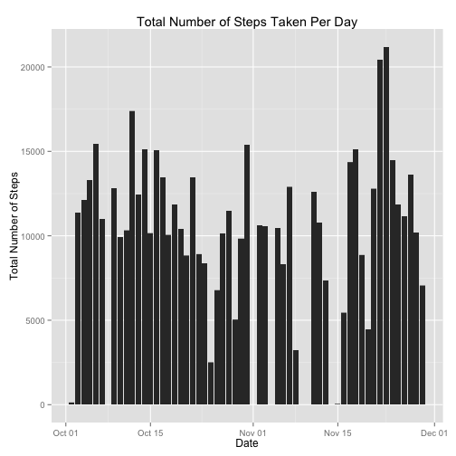
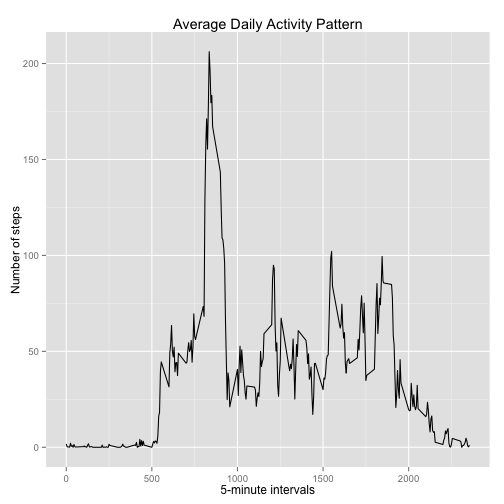
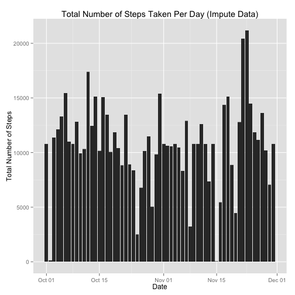
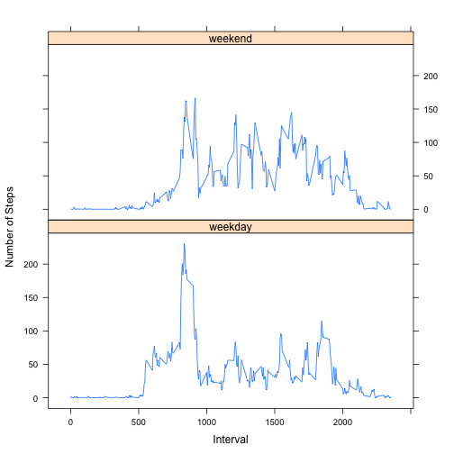

Reproducible Research_Peer Assessment 1
===============================================
## Loading and preprocessing the data

loading data

```r
data <- read.table("activity.csv", sep = ",", header = TRUE, na.strings = "NA", colClasses = c("integer", "Date", "factor"))
```

preprocessing data

```r
pdata <- na.omit(data)
```


## The mean total number of steps taken per day

Plot of the total number of steps taken per day

```r
stepsperday <- tapply(pdata$steps, pdata$date, sum)
ggplot(pdata, aes(date, steps)) + geom_histogram(stat = "identity", binwidth = 0.5) + ggtitle("Total Number of Steps Taken Per Day") + xlab("Date") + ylab("Total Number of Steps")
```

 

Calculate the Mean and Median value

```r
mean <- mean(stepsperday)
median <- median(stepsperday)
```
####The mean of steps taken per day is: 1.0766189 &times; 10<sup>4</sup>
####The median of steps taken per day is: 10765


## The average daily activity pattern

Plot of the average daily activity pattern

```r
avg <- aggregate(pdata$steps, list(interval = as.numeric(as.character(pdata$interval))), mean)
names(avg)[2] <- "avgsteps"

ggplot(avg, aes(interval, avgsteps)) + geom_line() + ggtitle("Average Daily Activity Pattern") + xlab("5-minute intervals") + ylab("Number of steps")
```

 

Calculate the maximum avgsteps, and report the interval contains maxinum steps

```r
maxsteps <- avg[avg$avgsteps == max(avg$avgsteps),]
maxinterval <- maxsteps[1]
```
####The interval contains maxinum mumber of steps is: 835


## Imputing missing values

Calculate the total number of missing values

```r
missingvalue <- sum(!complete.cases(data))
```
####The total number of missing values is: 2304

Imputing missing values by mean value at the same interval across days.

```r
impdata <- data
for (i in 1:nrow(impdata)) {
        if (is.na(impdata$steps[i])) {
                impdata$steps[i] <- avg[which(impdata$interval[i] == avg$interval), ]$avgsteps
        }
}
newmissingvalue <- sum(!complete.cases(impdata))
```
####The total number of missing values after imputing is: 0

Plot of total number of steps taken eacy day

```r
ggplot(impdata, aes(date, steps)) + geom_histogram(stat = "identity", binwidth = 0.5) + ggtitle("Total Number of Steps Taken Per Day (Impute Data)") + xlab("Date") + ylab("Total Number of Steps")
```

 

Calculate the Mean and Median value

```r
impsteps <- tapply(impdata$steps, impdata$date, sum)
newmean <- mean(impsteps)
newmedian <- median(impsteps)
```
####The mean of steps taken per day is:1.0766189 &times; 10<sup>4</sup>.
mean of imputed data is the same as that of original data.

####The median of steps taken per day is:1.0766189 &times; 10<sup>4</sup>.
median of imputed data is greater than that of original data.


## Are there differences in activity patterns between weekdays and weekends?

Create a new factor variable in the dataset with two levels – “weekday” and “weekend” indicating whether a given date is a weekday or weekend day.

```r
days <- factor(format(impdata$date, "%A"))
levels(days) <- list(weekday = c("Monday", "Tuesday", "Wednesday", "Thursday", "Friday"), weekend = c("Saturday", "Sunday"))
table(days)
```

```
## days
## weekday weekend 
##   12960    4608
```

Panel plot containing a time series plot of the 5-minute interval and the average number of steps taken, averaged across all weekday days or weekend days (y-axis). 

```r
newavg <- aggregate(impdata$steps, list(interval = as.numeric(as.character(impdata$interval)), weekdays = days), mean)
names(newavg)[3] <- "meanSteps"
library(lattice)
xyplot(newavg$meanSteps ~ newavg$interval | newavg$weekdays, layout = c(1, 2), type = "l", xlab = "Interval", ylab = "Number of Steps")
```

 

